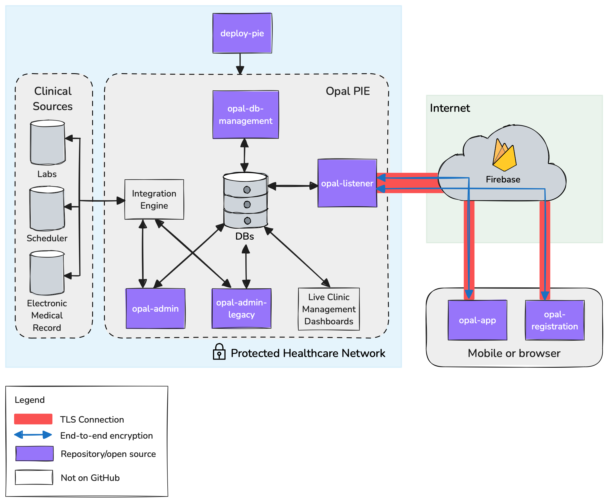

<!--
# SPDX-FileCopyrightText: Copyright (C) 2025 Opal Health Informatics Group <https://www.opalmedapps.com>
#
# SPDX-License-Identifier: CC-BY-SA-4.0
-->

# Welcome to Opal

Opal is the open-source patient-in-the-loop data platform.

We define patient-in-the-loop data as health data, with helpful explanations, that are shared in real-time with the patient (or their informal caregivers) just as they are with the other (professional) members of the patient's care team.

## Opal is now open source 🎉

We have recently (March 2025) open sourced Opal!
Some things might still need to be polished a bit.
Feel free to let us know if you spot anything, or maybe even contribute 🙂

## Quick links

- Documentation on Opal's architecture: https://docs.opalmedapps.com/development/architecture/
- Setting up your local development environment: https://docs.opalmedapps.com/development/local-dev-setup/
- Deploying Opal: https://docs.opalmedapps.com/install/

## Architecture Overview

At a high-level, the ***Opal patient-in-the-loop data*** platform's architecture is quite simple.
The platform's primary goal is to securely share data across the perimeter of a healthcare institution's protected network between the patient's Opal app and their medical record in the hospital's source systems. This is achieved using a cloud-hosted authentication system and Realtime Database relay. Currently, this service is provided by Google's Firebase service.

> [!NOTE]
> In the Details section below, repositories of components of the Opal platform are shown in parenthesis.
> These are also shown in purple in the diagram above.
> There is no repository for the *Integration Engine* as this is a hospital-specific integration system.
> The repository for the *Live Clinic Management Dashboards* (virtual waiting room and clinician dashboard) have not yet been added to GitHub.
> Please check back soon for them.

Details about Opal components

### Registration

Users register for an Opal account using a registration code that is generated by healthcare professionals inside the hospital using the OpalADMIN application (`opal-admin` and `opal-admin-legacy`).
On their mobile phone or browser, the user accesses the Opal registration web app (`opal-registration`) from which they securely communicate with the Opal Listener (`opal-listener`) running inside the hospital via *Firebase* (currently *Realtime Database*).
Once registered, the user is provided with their own personal Opal account using which they can access the patient's hospital data via the Opal App (`opal-app`).

### The Opal App

To retrieve patient data from the hospital, the user logs into their personal Opal account using the Opal App on their mobile phone or browser (`opal-app`).
Upon successful authentication, the user essentially places a request for their data on the *Realtime Database*.

**Note:** The user never logs into the hospital directly and the hospital's servers are never directly exposed to the internet.

### The Opal PIE

The Opal PIE is the Opal Patient Information Exchange.
It is essentially the complete Opal solution inside the hospital's network, comprising `opal-listener`, `opal-admin`, `opal-admin-legacy` and the Opal databases.

#### The Opal Listener

The Opal Listener (`opal-listener`) inside the hospital monitors the *Realtime Database* for requests for data from authenticated users.
When an authenticated request is received, the listener decrypts it, and fetches the data from the Opal database, or makes an API request to another component inside the Opal PIE.
The response is then encrypted so that only the user can decrypt them and puts the encrypted response onto the *Realtime Database* from where the user's Opal App (`opal-app`) then downloads it and displays it to the user.
In a similar way, the patient can send data into the hospital, such as by answering clinical questionnaires.

**Note:** Connections with Firebase are encrypted with TLS.
To protect the patient data, the data is also end-to-end-encrypted.
All requests and responses are encrypted on either side so that data cannot be read within the *Realtime Database*.
This is to ensure that only the Opal PIE in the hospital and the Opal App can access the unencrypted data.

#### OpalADMIN

The OpalADMIN (`opal-admin` and `opal-admin-legacy`) application is used by the clinical and administrative staff to set up the rules for publishing data for patients (which data from the source systems and how the data are presented to the patient, e.g., aliasing of clinical terms and provision of additional explanatory content).

## Overview of our repositories

The following repositories are available.
Repositories that begin with "opal" are components of the Opal platform.

- **opal-app:** The patient-facing web and mobile application (referred to as the *Opal Patient Portal*) used by users to access their patient data. [JavaScript, AngularJS, Cordova, Onsen UI].

- **opal-admin:** The staff-facing web application (referred to as *OpalADMIN*) used to create and manage the publishing of data and education materials to patients as well as access management for patients and staff (clinicians and administrative personnel).
  Note: This repository is Python/Django-based and contains the code base for all new features and functionality to OpalADMIN. [Python, Django]

- **opal-admin-legacy:** The staff-facing web application (referred to as *OpalADMIN Legacy*) used to create and manage the publishing of data and education materials to patients as well as access management for patients and staff (clinicians and administrative personnel).
  Note: this repository is PHP and Perl-based and contains the legacy version of OpalADMIN.
  It is used for maintenance-only development and should not be used to develop any new features or functionality. [PHP, Perl, JavaScript, AngularJS]

- **opal-listener:** The Opal listener application (referred to as the *Opal Listener*) that runs in the background and handles requests from the Opal Patient Portal and the Opal Registration site via Firebase. [Node.js]

- **opal-registration:** The public-facing webpage (referred to as the *Opal Registration site*) where Opal users can create their Opal accounts. [JavaScript, AngularJS]

- **opal-db-management:** Opal's database utility used to manage revisions and data for the Opal legacy databases.
  Note: The current Opal database is managed using the Django framework in `opal-admin`. [Alembic, Python, MySQL]

- **deploy-pie:** Copier template to deploy the Opal PIE.
  The Opal PIE is the Opal Patient Information Exchange, consisting of the Opal Listener, OpalADMIN, OpalADMIN Legacy, and all associated databases and scripts.

- **docs:** Opal's documentation site written in Markdown. [MkDocs, mkdocs-material]

## Resources

- Opal Website: https://www.opalmedapps.com
- Opal community page: https://www.opalmedapps.com/community
- Documentation: https://docs.opalmedapps.com
- Community discussions: https://github.com/orgs/opalmedapps/discussions
